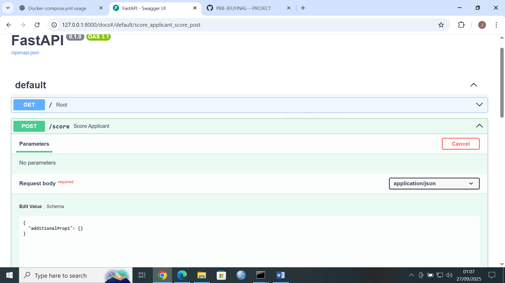

 


 


📄 README.md
# 🧑‍💻 AI-Driven Applicant Selection Tool

This project is an **AI-powered recruitment assistant** that helps HR teams manage applicants more efficiently.  
It provides a **Streamlit frontend** for interaction, a **FastAPI backend** for business logic, and a **database** for storing applicant data and resumes.  
The backend integrates with **OpenAI** to analyze resumes and assist in candidate selection.

PROJECT LINKS

PITCH DECK LINK: https://www.canva.com/design/DAGxdQknWks/Je0ChnlGqcfjwFsXVMOQ5A/edit?utm_content=DAGxdQknWks&utm_campaign=designshare&utm_medium=link2&utm_source=sharebutton
 

GITHUB REPOSITORY LINK: https://github.com/PBB-JEF/FINAL---PROJECT.git

DEPLOYMET LINK: 

Streamlit Cloud link : https://final---project-qohb62jqyc5msfczwhzqi4.streamlit.app/

FRONTEND:
Local url: http://localhost:8501

Network url: http://10.194.187.45:8501

BACKEND:
Backend runs at: http://127.0.0.1:8000

Test backend API
curl http://127.0.0.1:8000/applicants

API runs at: http://127.0.0.1:8000

Docs available at: http://127.0.0.1:8000/docs

ENDPOINTS:
Runs at: http://127.0.0.1:8000/docs#/default/score_applicant_score_post

---

## 🚀 Features
- 📂 Upload & store applicant resumes
- 📊 Manage applicant data (CSV → database)
- 🤖 AI-powered resume analysis using OpenAI API
- 🌐 REST API endpoints via FastAPI
- 🖥️ Streamlit frontend for user interaction
- 🗄️ Database support (SQLite by default, extendable to PostgreSQL/MySQL)

---

PROJECT STRUCTURE


│── applicant-selection/
│ ├── backend/
│ │ ├── main.py # FastAPI backend
│ │ ├── database.py # Database connection
│ │ ├── load_applicants.py # Load CSV into DB
│ │ ├── show_applicants.py # Show CSV in CMD
│ │ ├── .env # Backend environment variables
│ │
│ ├── frontend/
│ │ ├── streamlit_app.py # Streamlit app
│ │ ├── .env # Frontend environment variables
│ │
│ ├── SAMPLE_data/
│ │ ├── applicants.csv # Sample applicant data
│ │ ├── resumes/ # Resume files (PDF/DOCX)
│ │
│ ├── screenshots/ # App screenshots (for README/docs)
│ │ ├── frontend_ui.png
│ │ ├── api_docs.png
│
│── .gitignore # Ignore env files, venv, etc.
│── README.md
│── requirements.txt
│── docker-compose.yml (optional, if using containers
pip install -r requirements.txt
4. Install frontend dependencies

For Streamlit UI:

cd ../frontend
pip install streamlit requests
▶️ Running the Project
Run Backend (FastAPI)
cd %USERPROFILE%\Documents\applicant-selection\backend
uvicorn main:app --reload

Visit: http://127.0.0.1:8000/docs

Run Frontend (Streamlit)

Open a new terminal:

cd %USERPROFILE%\Documents\applicant-selection\frontend
streamlit run streamlit_app.py

Visit: http://localhost:8501

🐳 Optional: Run Database & Storage

If you have Docker installed:

cd %USERPROFILE%\Documents\applicant-selection
docker-compose up -d

This launches Postgres + MinIO.

📊 Sample Data

Put any test applicant CSVs or resume files in:

Documents/applicant-selection/sample_data/
🧩 Tech Stack

Backend: FastAPI, Pydantic, SQLAlchemy

Frontend: Streamlit

Database (optional): Postgres

Storage (optional): MinIO/S3


---

## ⚙️ Installation

### 1️⃣ Clone the repository
```bash
git clone https://github.com/your-username/applicant-selection-tool.git
cd applicant-selection-tool/applicant-selection

2️⃣ Create a virtual environment
python -m venv venv
venv\Scripts\activate   # On Windows
source venv/bin/activate  # On Mac/Linux

3️⃣ Install dependencies
pip install -r requirements.txt

🔑 Environment Setup
Backend (backend/.env)
DATABASE_URL=sqlite:///./chat.db
OPENAI_API_KEY=sk-your-real-openai-key-here
SECRET_KEY=my_super_secret_key

Frontend (frontend/.env)
API_BASE_URL=http://127.0.0.1:8000
APP_NAME="AI-Driven Applicant Selection Tool"

▶️ Running the Project
1️⃣ Load sample applicant data
cd backend
python load_applicants.py

2️⃣ Start the FastAPI backend
python -m uvicorn main:app --reload


API runs at: http://127.0.0.1:8000

Docs available at: http://127.0.0.1:8000/docs

3️⃣ Start the Streamlit frontend
cd ../frontend
streamlit run streamlit_app.py

📊 Testing
Show applicants in CMD
cd backend
python show_applicants.py

Test backend API
curl http://127.0.0.1:8000/applicants

🐳 (Optional) Docker Setup

If using Docker Compose:

docker-compose up --build

🤝 Contributing

Pull requests are welcome. For major changes, open an issue first to discuss what you’d like to change.

📜 License

This project is licensed under the MIT License.

GEOFFREY ODHIAMBO
STUDENT
